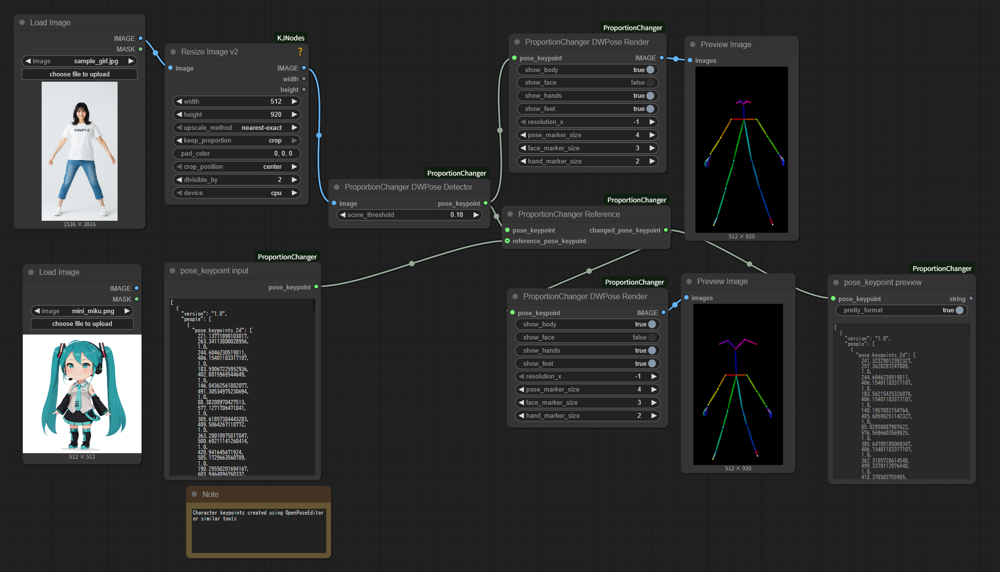

# ComfyUI-ProportionChanger

日本語 | [English README](README.md)

> **注意**: このREADMEは[Claude Code](https://claude.ai/code) AI支援開発ツールを使用して自動生成されました。

このカスタムノードは、[kijai氏のComfyUI-WanVideoWrapper](https://github.com/kijai/ComfyUI-WanVideoWrapper)のWanVideo UniAnimate DWPose Detectorノードを分解してポーティングしたものです。違いは、画像で入力していたところをDWPoseのKeyPointで入力できるようになったことで、これによりDWPoseでKeyPointが推定できないような体型でも操作ができるようになっています。

さらに、[toyxyz/ComfyUI-ultimate-openpose-editor](https://github.com/toyxyz/ComfyUI-ultimate-openpose-editor)のOpenpose Editorノードも同様に分解してポーティングしています。これにより、各パーツ微調整が可能になっています。

## 機能

### ノード紹介
- **ProportionChanger DWPose Detector**: 画像からDWPoseのKeyPointを検出する
- **ProportionChanger Reference**: 参照用ポーズにプロポーションを変換する
- **ProportionChanger DWPose Render**: KeyPointを画像に変換する
- **ProportionChanger Params**: KeyPointの各パーツのパラメータを調整する
- **ProportionChanger Interpolator**: KeyPoint動画を中割りして補間する
- **PoseData to pose_keypoint**: WanAnimateの`POSEDATA`を`POSE_KEYPOINT`に変換する
- **pose_keypoint input**: JSONテキストからKeyPointに変換する
- **pose_keypoint preview**: KeyPointからJSONに変換する

## インストール
### ComfyUI Managerでインストール
1. ComfyUI MangerのCustom Nodes Mangagerから「ComfyUI-ProportionChanger」を検索してインストール

2. ComfyUIを再起動

### 手動インストール

1. `custom_nodes`フォルダにこのリポジトリをクローン：
```bash
cd ComfyUI/custom_nodes
git clone https://github.com/grmchn/ComfyUI-ProportionChanger.git
```

2. 依存関係をインストール：
```bash
cd ComfyUI-ProportionChanger
pip install -r requirements.txt
```

3. ComfyUIを再起動

## 使用方法

### 基本ワークフロー

example_workflowsを参照してください。



### WanAnimate POSEDATAの変換
- WanAnimatePreprocessの「Pose and Face Detection」で`POSEDATA`を取得
- **PoseData to pose_keypoint**ノードに`POSEDATA`とキャンバスの`width`/`height`を入力
- 出力された`pose_keypoint`をProportionChanger Reference / Renderノードに接続
- サンプルワークフロー: `example_workflows/proportion_changer_pose_data_to_pose_keypoint.json`


## トラブルシューティング

### よくある問題
1. **モデル読み込みエラー**: HuggingFaceから自動ダウンロードされるはずです。DWPoseモデルが正しいディレクトリにあることを確認してください。
2. **リファレンス画像ありでプロポーション変換した後の体型がおかしい**:リファレンス画像のサイズをポーズ画像側と同じにしてください。体の各パーツの微調整は、「ProportionChanger Params」ノードで行ってください。
3. **リファレンス画像ありでプロポーション変換した後に何も表示されない**:リファレンス画像のDWPoseによる姿勢推定が失敗しています。OpenposeEditorなどを利用してパラメータの数値を入力してください。

## 帰属とクレジット
### Special Thanks
- **[kijai/ComfyUI-WanVideoWrapper](https://github.com/kijai/ComfyUI-WanVideoWrapper)**
- **[toyxyz/ComfyUI-ultimate-openpose-editor](https://github.com/toyxyz/ComfyUI-ultimate-openpose-editor)**

### ライセンス

このプロジェクトは、異なるライセンスのソース素材を組み合わせているため、**GPL 3.0**でライセンスされています：

- **主要ソース**: [kijai/ComfyUI-WanVideoWrapper](https://github.com/kijai/ComfyUI-WanVideoWrapper) (Apache 2.0)
- **二次ソース**: [toyxyz/ComfyUI-ultimate-openpose-editor](https://github.com/toyxyz/ComfyUI-ultimate-openpose-editor) (GPL 3.0)

Apache 2.0とGPL 3.0ライセンスのプロジェクトからコードを組み合わせる場合、ライセンス互換性ルールに従って結果の派生作品はGPL 3.0で配布する必要があります。

### 著作権表示

- オリジナルWanVideo UniAnimate DWPose Detector: Copyright by kijai
- ProportionChanger Params機能: Copyright by toyxyz  
- 修正・統合: このプロジェクトの貢献者

完全なGPL 3.0ライセンス条項については[LICENSE](LICENSE)ファイルを参照してください。
